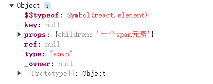

# 体验react


## 1. react 核心库 React.createElement

*React.createElement 生成的不是 html 对象,而是一个 react 虚拟对象*

创建一个React元素，称作虚拟DOM，本质上是一个对象


```js

var span = React.createElement("span", {}, "一个span元素");
console.dir(span)

```


2. React.createElement

    1. 参数1：元素类型，如果是字符串，一个普通的HTML元素
    2. 参数2：元素的属性，一个对象
    3. 后续参数：元素的子节点


```js

    //创建一个span元素
    var span = React.createElement("span", {}, "一个span元素");
    //创建一个H1元素
    var h1 = React.createElement("h1", {
        title: "第一个React元素"
    }, "Hello", "World", span);
    ReactDOM.render(h1, document.getElementById("root"));

```

## 2. JSX

JS的扩展语法，需要使用babel进行转义。

```html

<!-- <script></script>  -->
<!-- <script type='text/script'></script> -->
<!-- 上面两种写法是一样的 -->


<!-- <script type="text/babel"></script> -->


```