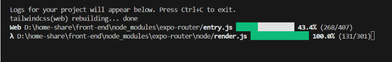

# [NativeWind Bug] The web platform does not word on windows

## 1. bug description

No error message or anything, the terminal just freezes. I have tried with both npm and yarn. At least in my case, the issue is only on Windows 10. I have tried on macOS and everything works fine.

编译过程中，没有报错信息，卸载 node module, 用 npm yarn bun 下载包，都一样的结果, 编译不过去，也不报错。
只有 windows 出现这个情况，macOS 一切正常。



## 2. fix bug

### 1. package.json

```json

"scripts": {
  "start": "node fix.js && expo start"
},

```

### 2. 新建一个文件 fix.js 放在根目录

```js
// fix.js
const fs = require("fs");
const path = require("path");

const filePath = path.join(".", "node_modules", "nativewind", "dist", "metro", "transformer.js");

fs.readFile(filePath, "utf8", (err, content) => {
  if (err) {
    console.error(err);
    return;
  }

  const issue = "`require('${config.nativewind.output}');`";

  if (!content.includes(issue)) {
    console.log("NativeWind fix already applied!");
    return;
  }

  const fix = "`require('${config.nativewind.output.replace(/\\\\/g, '\\\\\\\\')}');`";
  const result = content.replace(issue, fix);

  fs.writeFile(filePath, result, "utf8", (err) => {
    if (err) {
      console.error(err);
      return;
    }
    console.log("NativeWind fix applied successfully!");
  });
});

```
