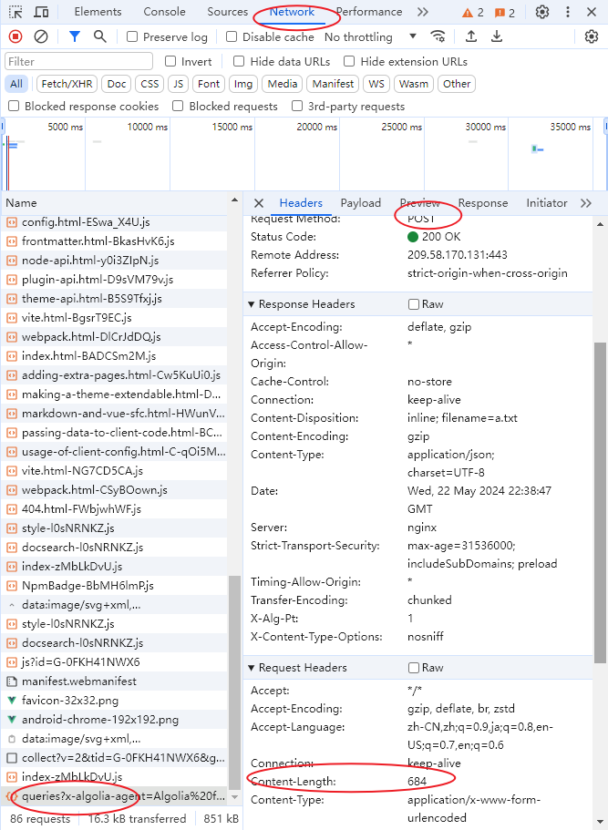

# debugger时,get post请求的content-length


```js
1. F12
2. Network
3. 找到一个 post 请求
4. Headers
5. Request Headers
6. Content-Length
7. 如果 content-length 为 0, post 请求失败, 代表传递数据是通过 param, 不是在 body 里传的。


export function getList(data) {
  return request({
    url: '/getlist',
    method: 'get',
    // ！！！！！！！
    params: data
  })
}


export function saveList(data) {
  return request({
    url: '/saveList',
    method: 'post',
    // ！！！！！！！
    data
  })
}


```


